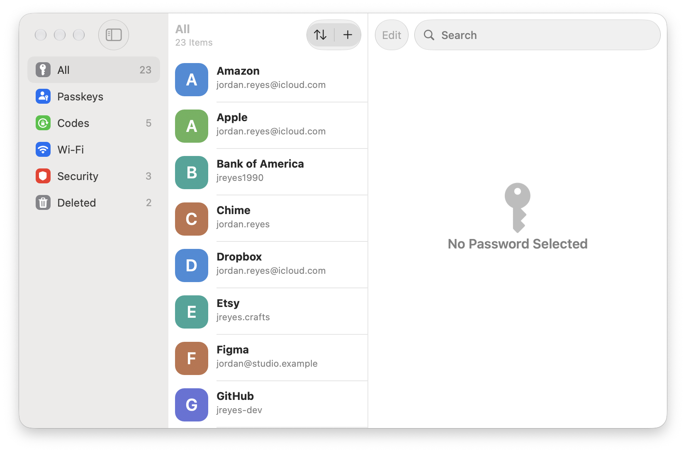
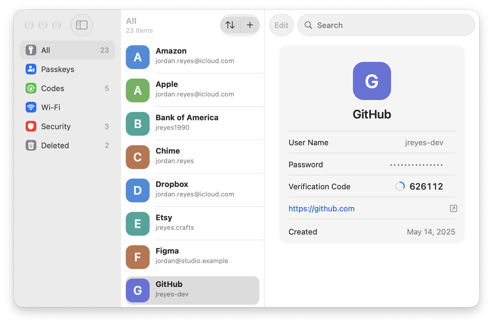
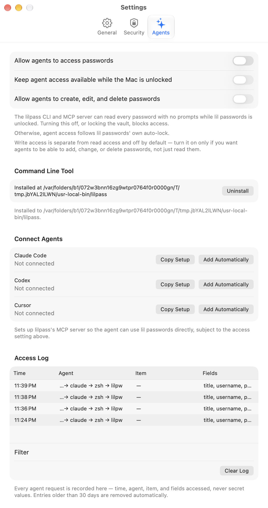
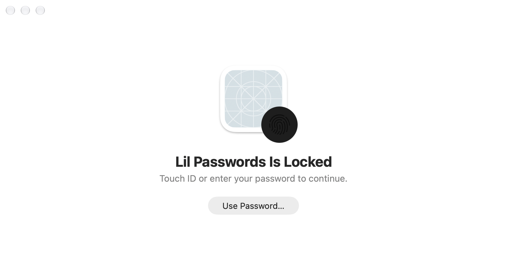
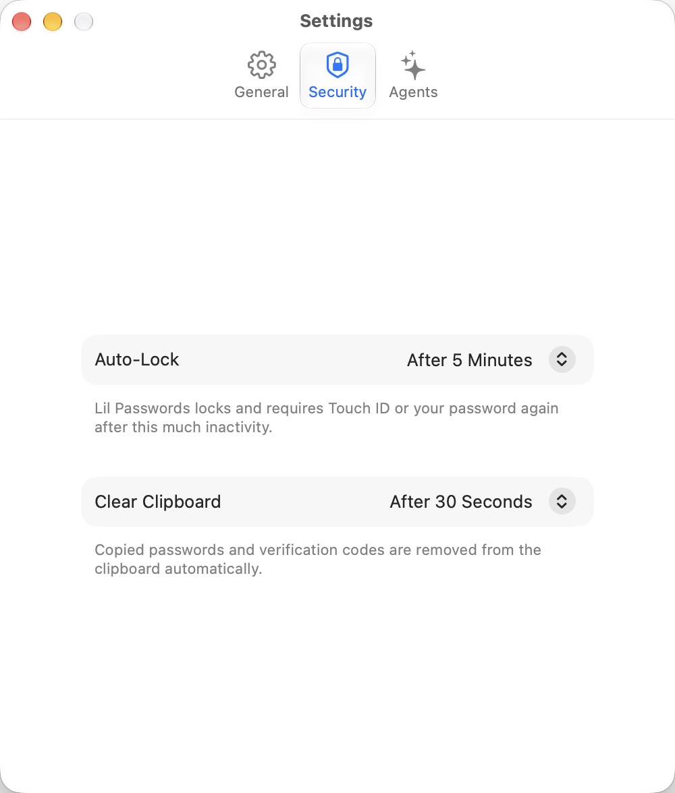
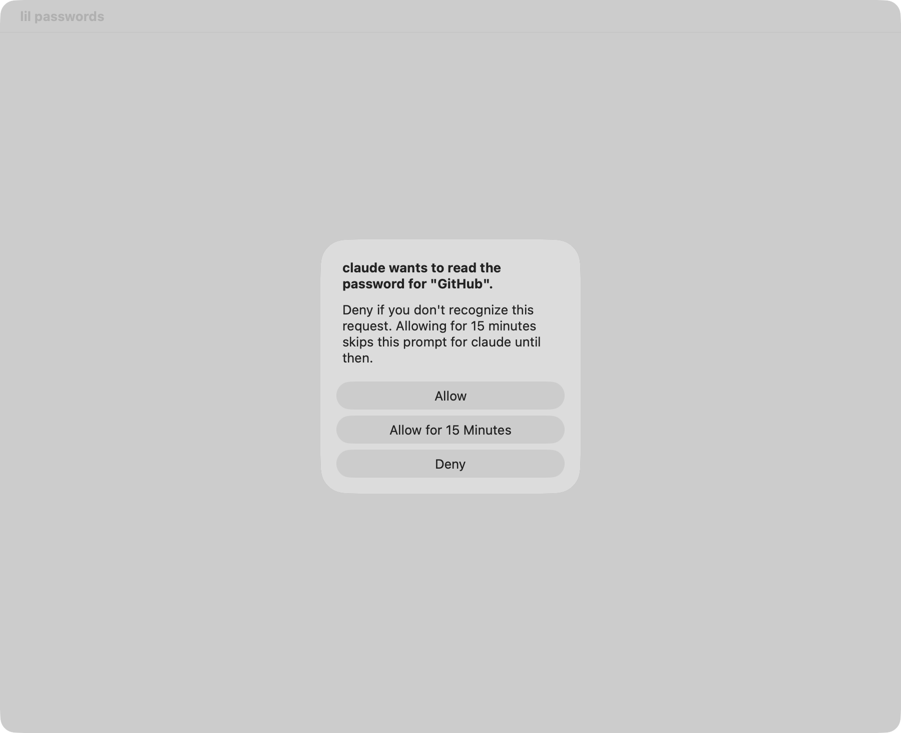

# lil passwords

A lil clone of Apple Passwords for macOS — a local, end-to-end encrypted password manager with a
CLI (`lilpass`) and an MCP server so coding agents can use your passwords without you ever pasting
one into a chat.

> Early days: this is a scaffold. Follow along in the [Linear project](https://linear.app/851/project/lil-passwords-ceedf3416b9d).

- **Platform:** macOS 13 Ventura or later, Swift 6, AppKit
- **Storage:** an end-to-end encrypted vault that stays on your Mac. Fully local: no accounts, no
  server, no iCloud.
- **Agents:** `lilpass` and `lilpass mcp` give local agents access to your passwords while the vault is
  unlocked and you've turned agent access on — read-only by default, optionally scoped to specific
  items, optionally read/write. Every access is logged, and you can turn it off any time — see
  [`SECURITY.md`](SECURITY.md) for exactly what that does and doesn't protect against.

## Screenshots

<table>
  <tr>
    <td></td>
    <td></td>
  </tr>
  <tr>
    <td align="center">Main window</td>
    <td align="center">Item detail, with TOTP</td>
  </tr>
  <tr>
    <td></td>
    <td></td>
  </tr>
  <tr>
    <td align="center">Settings → Agents: install, connect, and audit agent access</td>
    <td align="center">Locked, unlocked with Touch ID or your password</td>
  </tr>
  <tr>
    <td></td>
    <td></td>
  </tr>
  <tr>
    <td align="center">Security: reused/weak password warnings</td>
    <td align="center">"Ask Every Time" access scope: a per-request approval prompt</td>
  </tr>
</table>

## Features

- **A real password manager**: items with usernames, passwords, TOTP codes, notes, and associated
  websites; passkey and Wi-Fi item kinds; search; a strong password generator; website icons
  (opt-in — fetching one reveals which sites you have accounts for to those sites, so it's off by
  default); a Deleted items view before anything is gone for good.
- **End-to-end encrypted vault**, stored only on your Mac — see
  [`docs/adr/0002-crypto.md`](docs/adr/0002-crypto.md) and
  [`docs/adr/0003-vaultstore.md`](docs/adr/0003-vaultstore.md) for the crypto and storage design.
- **Lock/unlock** with Touch ID or your password, auto-lock after a configurable idle period, and
  clipboard auto-clear after copying a password (Settings → Security).
- **Compromised-password detection** (opt-in): checks each password's hash prefix against Have I
  Been Pwned's k-anonymity API (never the password itself) — off by default, alongside a local,
  always-on warning about weak or reused passwords.
- **AutoFill**, as a native macOS Credential Provider extension, for filling passwords and passkeys
  in other apps and Safari — currently only fully functional in a build signed with a real Apple
  Developer Program provisioning profile (tracked in
  [`docs/adr/0005-autofill-credential-provider.md`](docs/adr/0005-autofill-credential-provider.md));
  an ad-hoc/local build can compile it but macOS won't let it register as a credential provider.
  **Passkeys** (macOS 14+) ride the same extension and the same provisioning-profile requirement —
  registering and signing in with one always happens inside `LilPasswordsAgent`, triggered only by
  the AutoFill extension's own system-presented UI, never by `lilpass` or any agent; see
  [`docs/adr/0008-passkeys.md`](docs/adr/0008-passkeys.md) and [`SECURITY.md`](SECURITY.md).
- **A recovery key**, shown once when you set one up and re-generatable at any time from the app, that
  can restore the vault if you ever lose access to it any other way — see
  [`docs/adr/0002-crypto.md`](docs/adr/0002-crypto.md).
- **`lilpass`**, a local CLI (`lilpass list`, `get`, `read`, `totp`, `generate`, `run`, `inject`,
  `add`, `edit`, `rm`, …) and an MCP server (`lilpass mcp`, 8 tools) so a coding agent — Claude Code,
  Codex, Cursor, or anything else that can shell out or speak MCP — can read and, if you allow it,
  create/edit/delete saved credentials without you ever having to paste one into a prompt. Off by
  default; turn it on in Settings → Agents, where you can also scope it to specific items, or
  require a Touch ID approval for every request. One-click CLI install and MCP setup for Claude
  Code/Codex/Cursor live in the same pane. Full guide: [`docs/agents.md`](docs/agents.md). Wi-Fi
  network passwords are never part of this surface — see [`SECURITY.md`](SECURITY.md).
- **An access log** (Settings → Agents) recording every `lilpass`/`lilpass mcp` request — what was
  asked, which access scope/approval decision applied — so agent access is visible, not silent.
- **A guided first-run walkthrough**: create or restore your vault, optionally import existing
  passwords, and decide whether to turn on agent access, all in one setup flow.

## Install

**DMG** (once a release exists): download the latest `.dmg` from the
[Releases](https://github.com/851-labs/lil-passwords/releases) page, open it, and drag
**lil passwords.app** to Applications. See [`docs/releasing.md`](docs/releasing.md) for how
releases are built, signed, and notarized — today's builds are ad hoc signed (no Developer ID
certificate configured yet), so macOS will ask you to confirm opening an app from an
unidentified developer the first time.

**Homebrew cask** (planned, not yet published): `brew install --cask lil-passwords` once a cask
exists. Tracked alongside the release pipeline in [`docs/releasing.md`](docs/releasing.md).

**From source**: see [Building](#building) below.

`lilpass` ships inside the app bundle, at
`/Applications/lil passwords.app/Contents/Helpers/lilpass`. The easiest way to put it on your
`PATH`: Settings → Agents → Command Line Tool → **Install "lilpass" Command** — a one-click
install that symlinks it to `/usr/local/bin` (or `~/.local/bin` as a fallback). See
[`docs/agents.md`](docs/agents.md#2-install-lilpass) for doing it by hand instead.

## Architecture

Three processes, one shared package:

| Process | What |
| --- | --- |
| **lil passwords.app** | The AppKit UI: browsing/editing items, unlocking, Settings. Never touches the vault key or the Keychain directly. |
| **LilPasswordsAgent** | A per-user login-item helper ([`SMAppService`](https://developer.apple.com/documentation/servicemanagement/smappservice)) that owns the unlocked vault key and the on-disk store, and serves every request — from the app, `lilpass`, or `lilpass mcp` — over XPC. The only process that ever calls `SecItem*`. |
| **lilpass** | A CLI and stdio MCP server. Talks to `LilPasswordsAgent` over XPC for everything; a bare Mach-O with no app bundle, so it structurally can't hold an entitlement to reach the vault or Keychain on its own. |

```
lil passwords.app ─┐
                    ├──XPC──▶ LilPasswordsAgent ──▶ vault store + Keychain (vault key)
lilpass / lilpass mcp ┘
```

All three link **LilPasswordsKit**, the shared package with the item model, vault store, crypto,
TOTP, the password generator, and the XPC protocol/client/server types.

This split — one process holding the unlocked key, everything else asking it over XPC — is the
central design decision in this repo; the reasoning (and the alternatives considered) is in
[`docs/adr/0001-storage-and-process-model.md`](docs/adr/0001-storage-and-process-model.md). See
also [`docs/adr/0002-crypto.md`](docs/adr/0002-crypto.md) (vault key derivation, recovery key) and
[`docs/adr/0003-vaultstore.md`](docs/adr/0003-vaultstore.md) (on-disk format).

### Layout

| Path | What |
| --- | --- |
| `App/` | lil passwords.app (AppKit) |
| `Agent/` | `LilPasswordsAgent`, the login-item helper that owns the unlocked vault and serves XPC |
| `CLI/` | `lilpass`, the command-line tool and MCP server |
| `Packages/LilPasswordsKit/` | Shared core: model, vault, crypto, TOTP, generator, XPC |
| `Packages/LilpassE2E/` | End-to-end tests that run the built `lilpass` binary as a subprocess (`make e2e`) |
| `docs/adr/` | Architecture decision records |
| `docs/` | Agent setup guide, tophat notes, releasing, example skill/AGENTS.md snippets |
| `project.yml` | [XcodeGen](https://github.com/yonaskolb/XcodeGen) spec, the source of truth for `LilPasswords.xcodeproj` |

## Building

Requirements: Xcode 16+ and XcodeGen (`brew install xcodegen`).

```sh
make project   # regenerate LilPasswords.xcodeproj after changing project.yml
make build     # build the app, helper, and CLI (unsigned)
make test      # run LilPasswordsKit tests
make e2e       # end-to-end tests against the built lilpass binary (see Packages/LilpassE2E)
make lint      # swift-format --lint --strict
make format    # swift-format
```

Builds are ad-hoc signed by default, so anyone can build (CI does this too). lil passwords ships
under Alexandru Turcanu's Apple Developer team (`WH4QW9ND3J`, set in `Config/Base.xcconfig`). To
sign with a real certificate, create the gitignored `Config/Local.xcconfig`:

```
CODE_SIGN_IDENTITY = Apple Development
// Contributors on another team can also override:
// DEVELOPMENT_TEAM = YOURTEAMID
```

Release signing (Developer ID) and notarization are covered in
[`docs/releasing.md`](docs/releasing.md).

## Using `lilpass` from an agent

See [`docs/agents.md`](docs/agents.md) for the full guide: enabling agent access, installing
`lilpass`, the `lilpass run`/`lilpass inject` pattern that keeps secrets out of an agent's own
transcript, creating/editing/deleting items with `lilpass add`/`edit`/`rm` (gated behind a separate
write-access setting), `lilpass://item/field` references, exit codes, scoped access and Touch ID
approval, and MCP setup (8 tools; one-click "Connect Agents" setup for Claude Code, Codex, and
Cursor, or the manual config snippets). There's also a ready-to-drop-in
[Claude Code skill](docs/examples/skills/lilpass/SKILL.md) and an
[AGENTS.md snippet](docs/examples/AGENTS.md.snippet.md).

Before turning agent access on, read [`SECURITY.md`](SECURITY.md) — it's a real capability
("read every password in the vault, and write to it if you allow that too"), not a sandboxed one.

## Security

See [`SECURITY.md`](SECURITY.md) for the threat model behind agent access and lock/unlock, and how
to report a vulnerability.

## License

MIT
